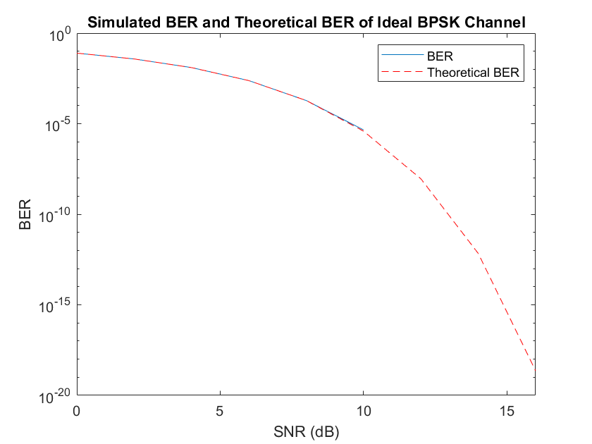
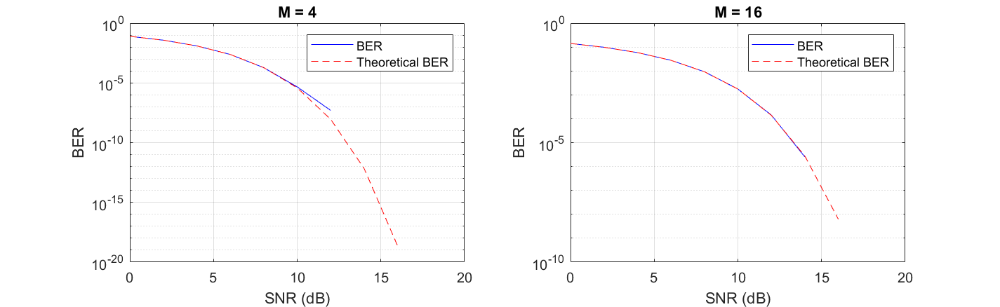
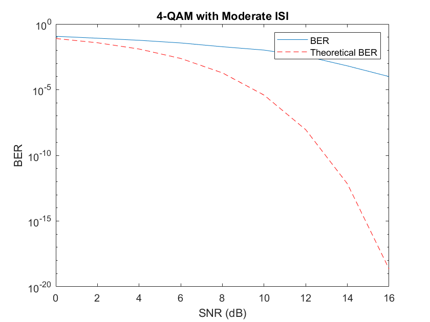
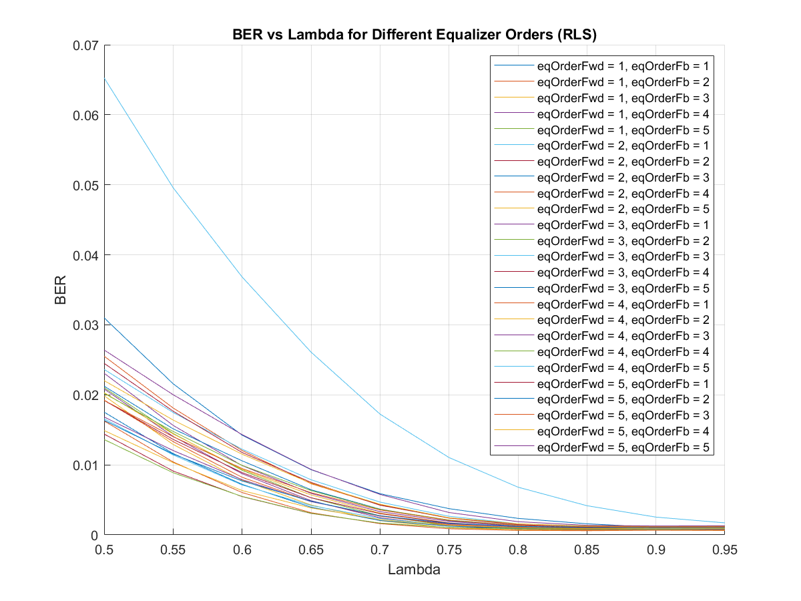
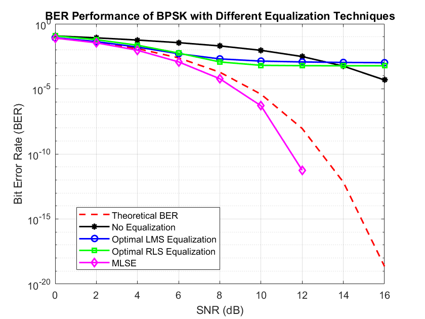
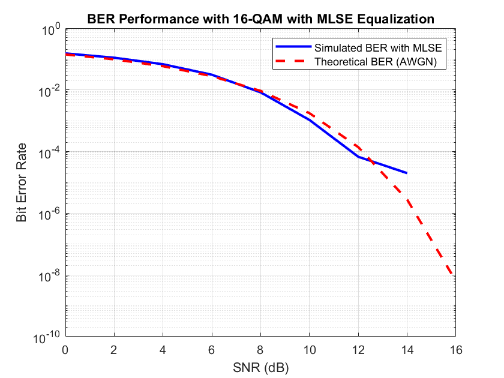
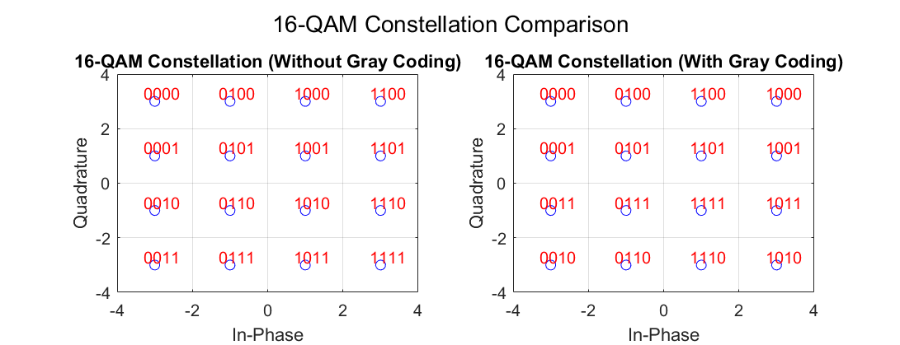
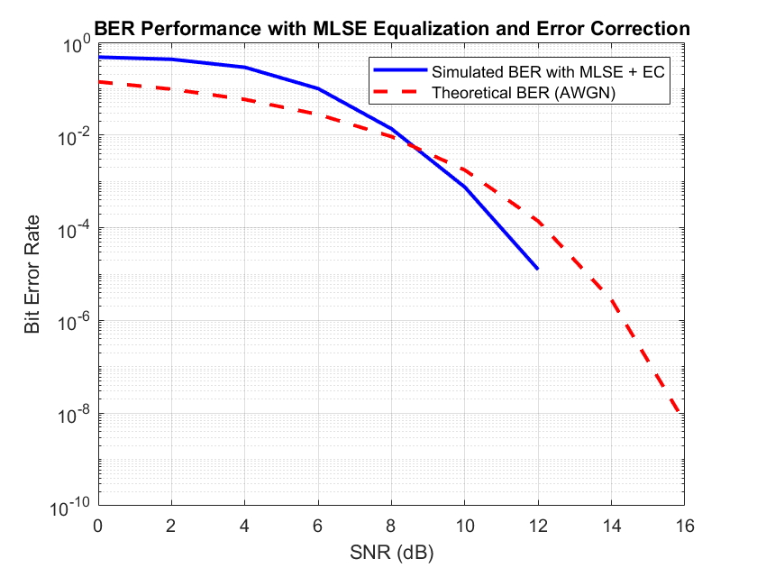
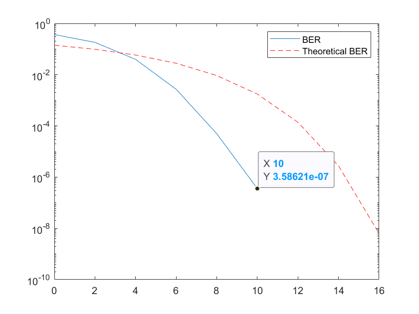
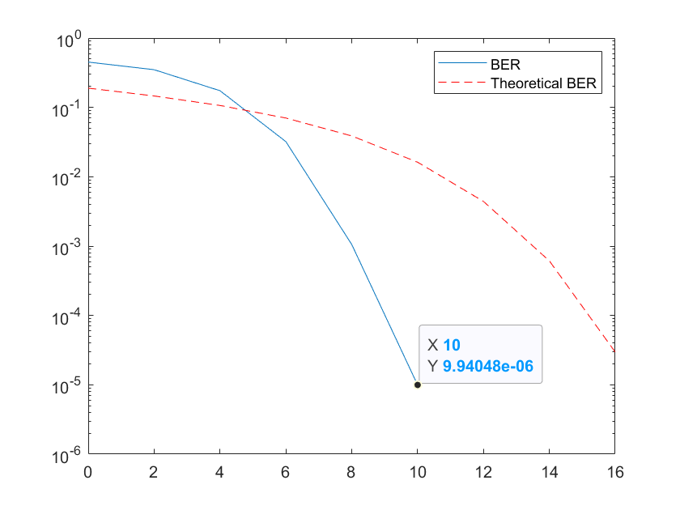

# Wireless Link BER Simulation with QAM, ISI, and Error Coding

This project is a MATLAB simulation of a digital communication system designed to handle **moderate inter-symbol interference (ISI)** while maintaining a high data rate and very low bit error rate (BER).

The system uses:

* **16-QAM modulation**
* **MLSE equalization**
* **Concatenated error coding** (Reed–Solomon + Convolutional with Viterbi decoding)

With this design, the system achieves a **BER below 10⁻⁷ at 12 dB SNR**, while still keeping an effective throughput of about **1733 bits per packet**.

## How the system works

1. Generate random bits.
2. Encode with Reed–Solomon (symbol-level) and Convolutional coding (bit-level).
3. Modulate using 16-QAM.
4. Send through a multipath channel (`[1, 0.2, 0.4]`) to introduce ISI.
5. Add AWGN noise, scaled manually so baseline BER matches theory.
6. Equalize with an MLSE equalizer.
7. Decode and measure BER.

## Results

### Noise Scaling Validation

Before adding ISI, the noise scaling was verified by comparing simulated BER to theoretical results.

*BPSK baseline matches theory.*

*4-QAM and 16-QAM in AWGN channel without ISI.*

### ISI Effects

Once ISI is added, BER performance degrades significantly without equalization.

*4-QAM with moderate ISI (`chan = [1, 0.2, 0.4]`).*

### Equalizer Comparison

Different equalization strategies were tested. MLSE consistently outperformed LMS and RLS.

*Grid search for RLS equalizer parameters.*

*Equalizer performance comparison on a BPSK link with moderate ISI.*

### Final 16-QAM with MLSE Equalization

With MLSE equalization applied, performance improves dramatically.

*16-QAM under moderate ISI with MLSE equalizer.*

Adding Gray coding to the constellation helps further:

*Gray-coded 16-QAM constellation.*

Error coding (Convolutional + RS) brings the BER well below the target:

*Effect of convolutional coding on BER.*

*Final system performance with concatenated coding + MLSE.*

### Honorable Mention: LDPC + 16-PSK

A more complex setup using π/4-16PSK + LDPC coding + MLSE was also tested, but was too computationally expensive to run for many iterations.

*Honorable mention BER curve with LDPC and 16-PSK.*
